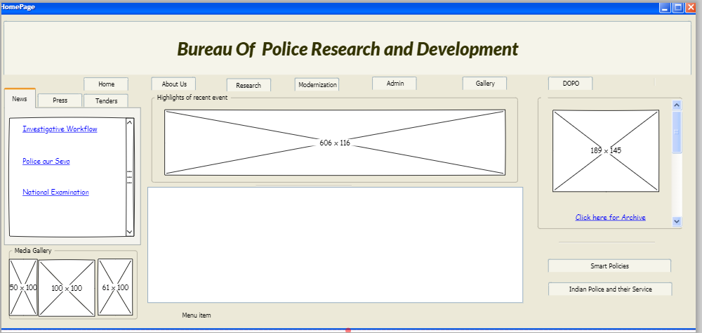
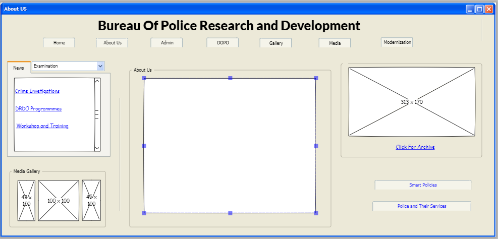
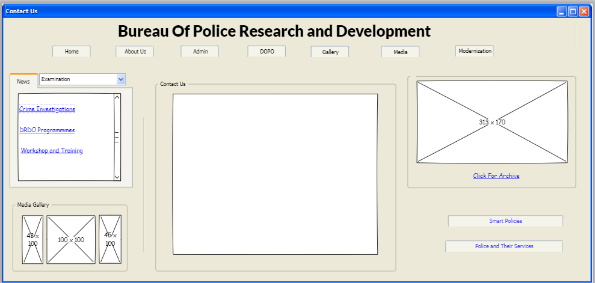

# Wire frame for a website
## AIM:
To design a wire frame for a website.
## DESIGN STEPS:
### Step 1:
Open Pencil Software.
### Step 2:
Design your webpage forusing Windows Desktop sketchy GUI.
## OUTPUT:

## Result:
Thus a wire frame is designed for a given website.
